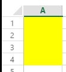
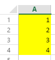

# Lesson 1: Warm Up


## Setup

1.1 Open Excel (preferably the desktop version).

* We will be using the Excel JavaScript API. For information about the API requirements click the link below:
* [Excel JavaScript API Requirements](https://github.com/OfficeDev/office-js-docs/blob/master/reference/requirement-sets/excel-api-requirement-sets.md)
    * If you do not have the latest version of Excel, you can use Excel Online for this workshop.

1.2 Go to Insert > My Add-ins > the Store icon (red shopping bag).

1.3 Search for "Script Lab".

1.4 Click **Add**.

1.5 Click on the **Script Lab** tab and see the  **Code** and **Run** commands.


## Running the First Sample

1.6 In the **Code** pane, select **Samples**.

1.7 Select **Basic API** call (JavaScript).

1.8 In the **Run** pane, select the same.

1.9 Select a matrix of several cells (see photo below) and click the **Run Code** button.
* For example, if four cells are selected

    

Observations:

* The cells selected should be highlighted in yellow.

    

* Review the code in the Code pane.

Notice the ```Excel.run()``` invocation
```

$("#run").click(run);

function run() {
    Excel.run(function (context) {
        var range = context.workbook.getSelectedRange();
        range.format.fill.color = "yellow";
        range.load("address");
        return context.sync()
            .then(function() {
                console.log("The range address was \"" + range.address + "\".");
            });
    })
        .catch(function(error) {
            OfficeHelpers.UI.notify(error);
            OfficeHelpers.Utilities.log(error);
        });
}
```
Note the ```context.sync()``` and ```.then``` pattern. Asynchronous code must always
return a Promise.

Notice the output from the ```console.log()``` call on line 10 on the Firebug
Console tab.

Adding some functionality:

You can now edit the Basic API call (JavaScript) sample code and it will save it to your snippets.

1.10 Using the Script Lab code editor, modify the code to populate the cells with increasing numbers starting at 1.

For example, if four cells are selected, the output will look like this;



Hints:

* Use the ```.values``` property of the Range object.
* Remember to load "values" first and then sync.
* Fewer calls to ```context.sync``` mean fewer calls to the Office application.
* If you use another function to populate, remember to pass in the context as well as the range.
* If you get stuck, look at the other sample snippets for ideas.
* For more information about Range objects click on the link below:
    * [Range Object - JavaScript API for Excel](https://github.com/OfficeDev/office-js-docs/blob/master/reference/excel/range.md)

**Note:** If you've already done this lesson on your own, congratulations! You can skip to step 1.12. Otherwise, keep following the steps.

1.01 Change the following line: 

```
range.load("address");
```

To: 

```
range.load([ "address", "values"]);
```

1.02 After the following line:

```
console.log("The range address was \"" + range.address + "\".");
```

Add a call to a separate function in which we will populate the cells:

```
return populateRange(context, range); // Added this line of code
```

1.03 Now add the following populate function after the run() function:

```
// Added the following code block
function populateRange(context: Excel.RequestContext, range: Excel.Range) {
    console.log("populateRange: range is - ", range.address);
            var newValues = range.values;
            var counter = 1;
            for (var i = 0; i < newValues.length; i++) {
                for (var j = 0; j < newValues[i].length; j++) {
                    newValues[i][j] = counter++;
                }
            }
            range.values = newValues;

            return context.sync()
	    .then(function () {
			    console.log("finished populating the matrix");
			    });
}
```

1.04 Now run and test the code making sure that it works and shows as the image in 1.10.

1.11 Once satisfied, run it to show the populated cells.

1.12 Now you have a modified version of the Basic API call (JavaScript) sample code in MySnippets. Navigate to see that it's there.
* To get My Snippets, click on the hamburger menu in the top left corner of the code panel. Then click on My Snippets at the top. Then you should see your snippet under the **My snippets on this computer** section.
* This modified code in MySnippets will only remain in the add-in memory until you clear your browser cache.

1.13 Save your snippets on GitHub
* If you want to save your snippet, you can do that by first signing in with GitHub on the My Snippet page.
* Then click on the snippet you want to save. This will take you to the text editor portion of the code panel. 
* Hover over the share button and choose either **Public gist** or **Private gist**


