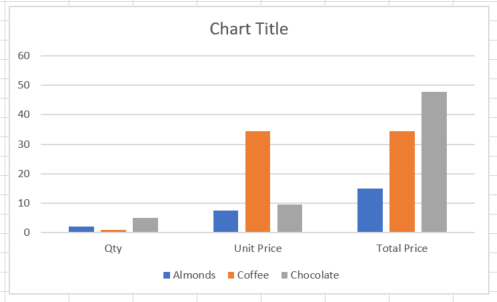

# Lesson 3: Charts

Now let's add a chart based on the code we've started in Lesson 2.

3.1 Add a button and code to create a chart for the price table B2:E5.
* Here is what the chart should look like:

    


Hints:
* Use the chart collection ``.add(type, sourceData, seriesBy)`` method and the ``ColumnClustered`` ``chartType``.
* See <https://dev.office.com/reference/add-ins/excel/chartcollection>
* See <https://github.com/OfficeDev/office-js-docs/blob/master/reference/excel/chart.md>

**Note:** If you did this on your own successfully, then you're done! Congratulations! Otherwise, do the next steps.

3.11 In the "Script" tab, add the function to handle the button for creating the chart:

```
async function createChart() {
    try {
        await Excel.run(async (ctx) => {
            var rangeSelection = "B2:E5";
            var range = ctx.workbook.worksheets.getItem("Sample")
                .getRange(rangeSelection);
            var chart = ctx.workbook.worksheets.getItem("Sample")
                .charts.add("ColumnClustered", range, "auto");
            await ctx.sync();
            console.log("New Chart Added");
        });
    }
    catch (error) {
        OfficeHelpers.UI.notify(error);
        OfficeHelpers.Utilities.log(error);
    }
}
```
3.12 Now add the button click handler hook-up, just after the Grand Total click handler hook-up, at the top of the module:

```
$("#create-chart").click(createChart);
```

3.13 Now add the button code in the "Template" tab:
```
<button id="create-chart" class="ms-Button">
    <span class="ms-Button-label">Add Chart</span>
</button>
```
