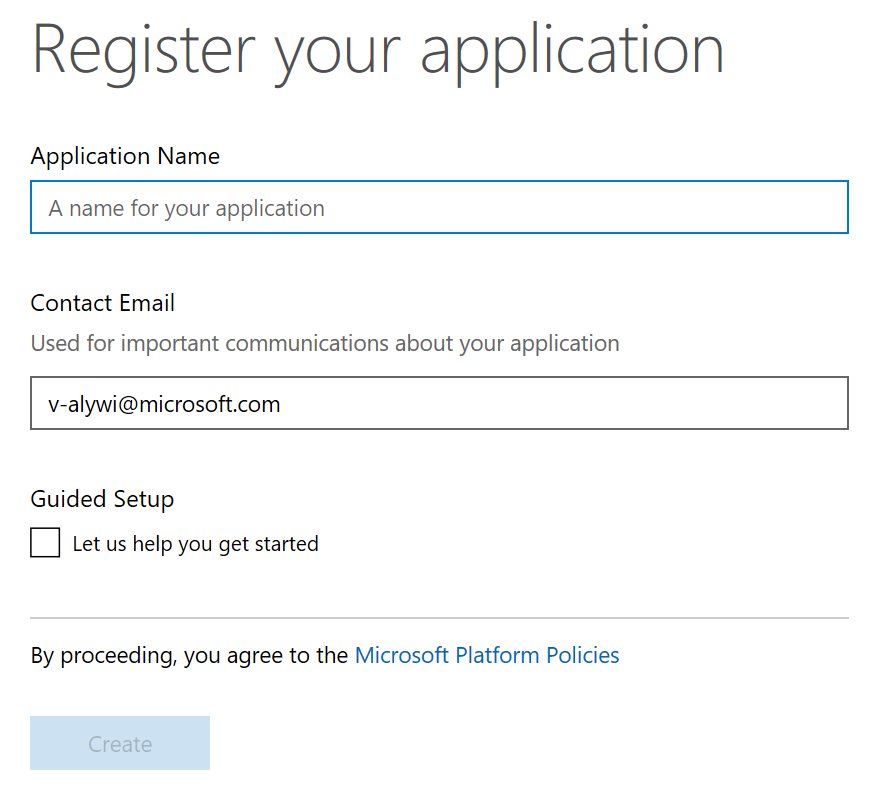

# Lesson 5 - Send Email within an Office Add-in

In this lesson we will be sending an email within an Office Add-in. Here are the technologies we will be using to accomplish this:
* [Microsoft Graph JavaSciprt SDK](https://github.com/microsoftgraph/msgraph-sdk-javascript)
* [Office JS Helpers](https://github.com/OfficeDev/office-js-helpers)

5.1 Create/setting up your Office Add-in project. It can be done in Visual Studios or any text editor. See the following links for instructions on how to create a new project. 
* [Any Editor](https://dev.office.com/docs/add-ins/get-started/create-an-office-add-in-using-any-editor)
* [Visual Studio](https://dev.office.com/docs/add-ins/get-started/create-and-debug-office-add-ins-in-visual-studio)

If you are using **Visual Studios**, add the following files to the project root. If you are using a **text editor**, create a folder called entites in the root of the project, then add the following files inside of the enetities folder.

   * ``home.html``
        ```
            <!DOCTYPE html>
            <html>
            <head>
                <meta charset="UTF-8">
                <meta http-equiv="X-UA-Compatible" content="ie=edge">
                <title></title>
                <!-- jQuery -->
                <script src="https://ajax.aspnetcdn.com/ajax/jQuery/jquery-3.1.1.min.js" type="text/javascript"></script>  
                <!-- Office.js -->
                <script src="https://appsforoffice.microsoft.com/lib/1/hosted/office.js" type="text/javascript"></script>
                <script src="https://static2.sharepointonline.com/files/fabric/office-ui-fabric-js/1.3.0/js/fabric.min.js"></script>
                <!-- Office JavaScript API Helpers (via CDN) -->
                <script src="https://unpkg.com/@microsoft/office-js-helpers@0.6.3/dist/office.helpers.min.js"></script>
                <script src="PATH_TO_GRAPH_JS_SDK" type="text/javascript"></script>
                <script src="home.js" type="text/javascript"></script>
                <link rel="stylesheet" href="https://static2.sharepointonline.com/files/fabric/office-ui-fabric-js/1.3.0/css/fabric.min.css">
                <link rel="stylesheet" href="https://static2.sharepointonline.com/files/fabric/office-ui-fabric-js/1.3.0/css/fabric.components.min.css">
                <link rel="stylesheet" href="home.css" />
            </head>
            <body>
                <div class="code-box">
                    <button class="ms-Button ms-Button--primary" id="sendOffer" style="width:250px">
                        <span class="ms-Button-label">Send Email</span>
                    </button>
                </div>
            </body>
            </html> 
        ```
    * ``home.css``
    * ``home.js``

* In the manifest.xml file change the source location default value and the urls default value
    ```
    <DefaultSettings>
        <SourceLocation DefaultValue="https://localhost:3000/entities/home.html" />
    </DefaultSettings>
    ```
    ```
        <bt:Urls>
            <bt:Url id="Contoso.Taskpane.Url" DefaultValue="https://localhost:3000/entities/home.html" />
            <bt:Url id="Contoso.GetStarted.LearnMoreUrl" DefaultValue="https://go.microsoft.com/fwlink/?LinkId=276812" />
            <bt:Url id="Contoso.DesktopFunctionFile.Url" DefaultValue="https://localhost:3000/function-file/function-file.html" />
      </bt:Urls>
    ```

5.2 Before we start coding the Office Add-in you need to register your application. Registerin the application gives you the ``clientId`` that is needed to do authentication with Office JS Helpers. See the application registration link below.
* [Application Registration](https://apps.dev.microsoft.com/#/appList)

How to register application:
1. Log into application registration portal
2. Click on the **Add an app** button
3. Fill in the application name and press **Create**

4. Under Platforms, click on the **Add platform** button. This will bring up a modal with three options - Web, Native Application, Web API. Click on the **Web** button.
5. A box will pop up under the **Add platform** button. Make sure the **Allow Implicit Flow** checkbox is checked. In the **Redirect URLs** input put the following URL ``https://localhost:3000/PATH_TO_HOME.HTML``. Then click **Add URL**

6. In the Microsoft Graph Permissions section, we will need to add two more **Delegate permissions**. The delegate permission you start with is ``User.Read``. Click the **Add** button. A modal will appear. Check the boxes for the two following permissions - ``Mail.Send`` and ``User.Read.All (Admin only)``, then click **Ok**. 
7. After you have completed the form, scroll to the bottom of the page and click on **Save**. 

5.3 We will be using the [Office JS Helpers](https://github.com/OfficeDev/office-js-helpers) to do the authentication portion of our Add-in. The reason we need to do authentication is because the Microsoft Graph JavaScript SDK requires you to initialize the client with an access token. 

Office JS Helpers Setup:
1. You need to use ``https``. This is important as we are using OAuth Implicit Flow and it is critical to secure the communication over the wire.
2. Add the location of the provider in your AppDomains, example:
    ```
        <AppDomain>https://login.windows.net</AppDomain>
        <AppDomain>https://login.microsoftonline.com</AppDomain>
    ```
3. Add the following code block to the ``home.js`` file
    ```
    var clientId = "CLIENT/APPLICATION ID GOES HERE";
    var authenticator;
    var graphToken;

    (function () {
        "use strict";
        var messageBanner;

        Office.initialize = function (reason) {
            $(document).ready(function () {

                // STEP 2: This to inform the Authenticator to automatically close the authentication dialog once the authentication is complete.
                if (OfficeHelpers.Authenticator.isAuthDialog()) return;
                
                $('#sendOffer').click(
                    sendEmailPrep);
            });
        };


        function sendEmailPrep() {

            // STEP 3: Create a new instance of Authenticator and register the endpoints
            authenticator = new OfficeHelpers.Authenticator();

            // Optional: Delete the cached Token.
            if (authenticator.tokens[OfficeHelpers.DefaultEndpoints.Microsoft])
                authenticator.tokens.remove(OfficeHelpers.DefaultEndpoints.Microsoft);


            authenticator.endpoints.registerMicrosoftAuth(clientId, {
                redirectUrl: 'https://localhost:3000/PATH_TO_HOME.HTML', 
                scope: 'User.Read.All, Mail.Send'
            });

            // STEP 4: To authenticate against the registered endpoint, do the following
            authenticator
                .authenticate(OfficeHelpers.DefaultEndpoints.Microsoft)
                .then(function (token) {
                    if (!token) {
                        console.log("ADAL error occurred: " + error);
                        return;
                    }
                    else {
                        console.log(token);
                        clientCall(token);
                    }
                })
                .catch(function (error) {
                    console.log(error);
                });
        }
    })();

    ```

5.4 The final step we need to complete in order to get the **Send Email** button in the add-in working, is using the **Microsoft Graph JavaScript SDK**. 

Before we update the code to send an email, take a look at some of the Microsoft Graph documenation below:
* [Microsft Graph JS SDK GitHub](https://github.com/microsoftgraph/msgraph-sdk-javascript)
* [Microsoft Graph Send Mail](https://developer.microsoft.com/en-us/graph/docs/api-reference/v1.0/api/user_sendmail)

Here is the code we will be adding in to get the Office Add-in to send an email after the button is clicked.

```
    function clientCall(token) {

        graphToken = token;
        var client = MicrosoftGraph.Client.init({
            authProvider: function (done) {
                done(null, graphToken.access_token); //first parameter takes an error if you can't get an access token
            }
        });


        const mail = {
            subject: "Email from Add-in",
            toRecipients: [{
                emailAddress: {
                    address: "v-alywi@microsoft.com"
                }
            }],
            body: {
                content: "Hello, You've Got an EMail",
                contentType: "html"
            }
        };

        client
            .api('/users/me/sendMail')
            .post({ message: mail }, function (err, res) {
                console.log(res); 
                console.log(err)

                // Run a batch operation against the Word object model.
                Word.run(function (context) {

                    // Create a proxy object for the paragraphs collection.
                    var paragraphs = context.document.body.paragraphs;

                    // Queue a commmand to load the style property for the top 2 paragraphs.
                    // We never perform an empty load. We always must request a property.
                    context.load(paragraphs, { select: 'style', top: 2 });

                    // Synchronize the document state by executing the queued commands, 
                    // and return a promise to indicate task completion.
                    return context.sync().then(function () {

                        // Queue a command to get the first paragraph.
                        var paragraph = paragraphs.items[0];

                        // Queue a command to insert the paragraph after the current paragraph.
                        paragraph.insertParagraph('Hurray!! You sent an Email using Graph API', Word.InsertLocation.after);

                        // Synchronize the document state by executing the queued commands, 
                        // and return a promise to indicate task completion.
                        return context.sync().then(function () {
                            console.log('Inserted a new paragraph at the end of the first paragraph.');
                        });
                    });
                })
                .catch(function (error) {
                    console.log('Error: ' + JSON.stringify(error));
                    if (error instanceof OfficeExtension.Error) {
                        console.log('Debug info: ' + JSON.stringify(error.debugInfo));
                    }
                });

            });
    }
```
